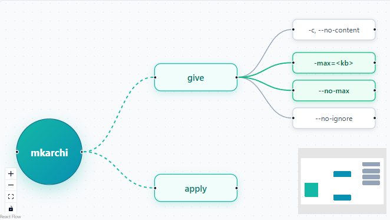

# 🏗️ mkarchi

---
mkarchi (make architecture) is a command-line tool that generates complete project structures from simple tree-format text files — and now, with v0.1.7, it can also generate mkarchi syntax from an existing project with enhanced features and better performance.

Design your architecture once, apply it anywhere, or reverse-engineer your folders back into mkarchi format.

---

[](https://pepy.tech/projects/mkarchi)
[](https://www.python.org/)
[](https://github.com/SoufyanRachdi/mkarchi)
[](https://opensource.org/)
[](https://github.com/SoufyanRachdi/mkarchi)
[](https://opensource.org/licenses/MIT)
[](https://github.com/SoufyanRachdi/mkarchi/releases)


[](https://pypi.org/project/mkarchi/)
[](https://pypi.org/project/mkarchi/)




---

# ✨ Features

📁 Create directories from a tree structure
📄 Create empty files automatically
✍️ Create files with content using (begincontenu) / (endcontenu)
🎯 Preserve indentation (perfect for Python, YAML, JSON…)
💬 Support comments inside structure files
🔄 Generate mkarchi structure from existing folders
🚫 Smart `.gitignore` support — skip ignored files automatically (NEW in v0.1.7)
⚡ Improved performance and error handling (NEW in v0.1.7)
🚀 Fast, simple, and AI-friendly

---

# 📦 Installation

## ✅ Recommended (via pip)

```bash
pip install mkarchi
```

## Option 2: Install from source

```bash
git clone https://github.com/yourusername/mkarchi.git
cd mkarchi
pip install -e .
```

## Option 3: Run as module (no installation)

```bash
git clone https://github.com/yourusername/mkarchi.git
cd mkarchi
python -m mkarchi apply structure.txt
```

---

# 🚀 Quick Start

## 1️⃣ Create a structure file

Create a file called structure.txt:

```text
my_project/
├── src/
│   ├── main.py(begincontenu)
│   │   def main():
│   │       print("Hello, World!")
│   │
│   │   if __name__ == "__main__":
│   │       main()
│   (endcontenu)
│   └── utils.py(begincontenu)
│       def helper():
│           return "Helper function"
│   (endcontenu)
├── tests/
│   └── test_main.py
├── README.md(begincontenu)
│   # My Project
│
│   This is an awesome project!
│   (endcontenu)
└── requirements.txt(begincontenu)
    pytest>=7.0.0
    requests>=2.28.0
(endcontenu)
```

## 2️⃣ Run mkarchi

```bash
mkarchi apply structure.txt
```

## 3️⃣ See the magic ✨

```text
🚀 Creating structure from structure.txt...

📁 Created directory: my_project
📁 Created directory: my_project/src
📄 Created file with content: my_project/src/main.py
📄 Created file with content: my_project/src/utils.py
📁 Created directory: my_project/tests
📄 Created file: my_project/tests/test_main.py
📄 Created file with content: my_project/README.md
📄 Created file with content: my_project/requirements.txt

✅ Architecture created successfully!
```

---

# 📖 Usage

```bash
mkarchi apply structure.txt
mkarchi give [options] [output_file]
mkarchi --help
mkarchi --version
mkarchi -v
```

---

# 🔄 mkarchi give — Generate Structure Files

Generate mkarchi syntax from your current directory.

## Default behavior

```bash
mkarchi give
```

➡️ Generates `structure.txt`  
➡️ Includes file contents  
➡️ Respects `.gitignore` automatically (NEW in v0.1.7)

## Generate structure without file contents

```bash
mkarchi give -c
```

or specify a custom output file:

```bash
mkarchi give -c myproject.txt
```

## 🚫 Smart .gitignore Integration (v0.1.7)

mkarchi now automatically reads your `.gitignore` file and excludes ignored files and directories when generating structure files. This means:

- No more `node_modules/` or `venv/` clutter
- `.git/` directories are skipped
- Build artifacts and cache files are excluded
- Binary files and dependencies stay out of your structure

**Example:**

If your `.gitignore` contains:

```
node_modules/
*.pyc
__pycache__/
.env
```

Running `mkarchi give` will automatically skip all these files and folders!

---

# 📄 Structure File Format

## 📁 Create Directories

Directories must end with `/`:

```text
my_folder/
├── subfolder/
└── another_folder/
```

## 📄 Create Empty Files

Files without `(begincontenu)` / `(endcontenu)` are created empty:

```text
my_folder/
├── empty_file.txt
└── config.json
```

## ✍️ Create Files with Content

Use `(begincontenu)` and `(endcontenu)` to define file content:

```text
script.py(begincontenu)
    print("Hello!")
    print("This is Python code")
(endcontenu)
```

## 🎯 Indentation Preservation

mkarchi automatically preserves indentation:

```text
utils.py(begincontenu)
    def greet(name):
        if name:
            print(f"Hello, {name}!")
        else:
            print("Hello, World!")
(endcontenu)
```

Result (utils.py):

```python
def greet(name):
    if name:
        print(f"Hello, {name}!")
    else:
        print("Hello, World!")
```

## 💬 Comments Support

Use `#` for comments in your structure file:

```text
project/
├── src/          # Source code
│   └── main.py   # Entry point
└── tests/        # Tests
```

---

# 🎯 Use Cases

### ⚡ Rapid project scaffolding
### 📦 Reusable templates
### 🤖 AI-generated architectures
### 📘 Documentation & tutorials
### 🧩 Microservices setup

```bash
mkarchi apply service1.txt
mkarchi apply service2.txt
```

### 🔄 Project documentation

Generate clean structure documentation without sensitive files:

```bash
mkarchi give myproject-structure.txt
```

---

# 🔧 Advanced Example (Python Project)

```text
python_project/
├── src/
│   ├── __init__.py
│   └── main.py(begincontenu)
│       """Main module."""
│
│       def main():
│           print("Starting application...")
│   (endcontenu)
├── tests/
│   ├── __init__.py
│   └── test_main.py(begincontenu)
│       import pytest
│       from src.main import main
│
│       def test_main():
│           assert main() is None
│   (endcontenu)
├── setup.py(begincontenu)
│   from setuptools import setup, find_packages
│
│   setup(
│       name="my-project",
│       version="0.1.0",
│       packages=find_packages(),
│   )
│   (endcontenu)
└── README.md
```

---

# 🆕 What's New in v0.1.7?

## 🚫 `.gitignore` Integration

Automatically respects your `.gitignore` patterns when generating structure files with `mkarchi give`. No more manual filtering!

## ⚡ Performance Improvements

- Faster file processing
- Optimized directory traversal
- Better memory management for large projects

## 🐛 Bug Fixes

- Enhanced error handling for edge cases
- Improved Unicode support for international characters
- Better handling of symbolic links

---

# 🤝 Contributing

Contributions are welcome! 🚀

Fork the repository

Create a feature branch:

```bash
git checkout -b feature/amazing-feature
```

Commit your changes:

```bash
git commit -m "Add amazing feature"
```

Push to your branch:

```bash
git push origin feature/amazing-feature
```

Open a Pull Request

---

# 📝 License

This project is licensed under the MIT License.  
See the LICENSE file for details.

---

# 🐛 Issues & Feedback

Found a bug or have a feature request?  
Please open an issue on [GitHub Issues](https://github.com/yourusername/mkarchi/issues).

---

# ⭐ Support the Project

If you find mkarchi useful, please consider giving it a ⭐ on GitHub!

---

### ❤️ Made with passion by Soufyan Rachdi
